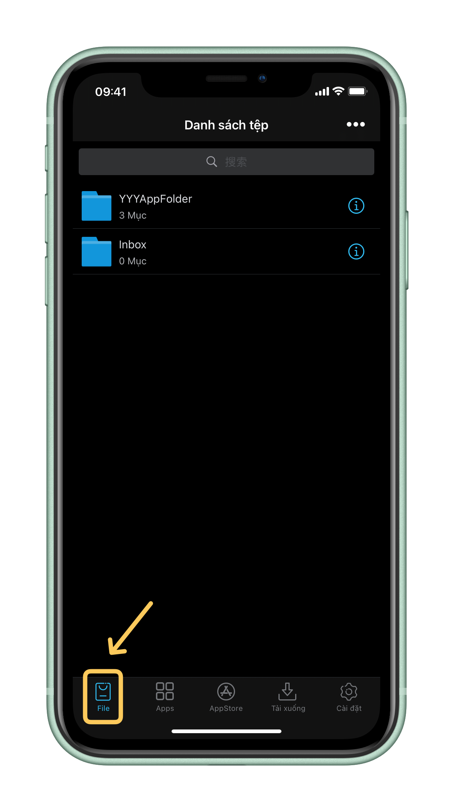

# 5️⃣ Cách ký và cài đặt .ipa Sử dụng ESign

**Bước 1: Mở&#x20;**<mark style="color:green;">**app ESign**</mark>**&#x20;và chắc chắn bạn đang ở tab&#x20;**<mark style="color:red;">**Tệp (File)**</mark>

<figure><figcaption></figcaption></figure>

**Bước 2: Tiếp theo, hãy bấm "•••" trên góc phải**

<figure><figcaption></figcaption></figure>

#### Bước 3: Bấm "Nhập" (Import)&#x20;

<figure><figcaption></figcaption></figure>

#### Bước 4: **Thư mục Tệp sẽ hiện lên, bạn cần tìm file&#x20;**<mark style="color:red;">**.ipa**</mark>**&#x20;ứng dụng muốn cài \[Bấm chọn file đó] Lưu ý: file trong ảnh chỉ là ví dụ:**

<figure><figcaption></figcaption></figure>

#### Bước 5: Khi bảng gợi ý nhập vào thư viện hiện lên hãy bấm "Nhập vào thư viện" (Import)

<figure><figcaption></figcaption></figure>

#### Bước 6: Tiếp theo, bạn hãy chuyển sang tab <mark style="color:blue;">Apps</mark>, chọn <mark style="color:red;">Chưa ký</mark> ở trên cùng, bạn sẽ thấy ứng dụng xuất hiện là ứng dụng bạn vừa nhập từ file <mark style="color:red;">.IPA</mark> vào thư viện từ bước 5

<figure><figcaption></figcaption></figure>

#### Bước 7: Bấm chọn app bạn muốn ký trong danh sách các Apps trên màn hình

<figure><figcaption></figcaption></figure>

#### Bước 8: Chọn "Ký" (Signature)

<figure><figcaption></figcaption></figure>

#### Bước 9:  Nếu không có gì cần thay đổi hãy bấm "Chữ ký" (Signature)

<figure><figcaption></figcaption></figure>

**Đợi cho đến khi quá trình ký app hoàn thành và bấm "Cài đặt" (Install), Sau đó bảng cài đặt hiện ra và bấm "Cài đặt" (Install) một lần nữa**

<figure><figcaption>
Tiếp tục bấm vào nút cài đặt như ảnh ở dươi
</figcaption></figure> <figure><figcaption>
Bước cuối cùng đẻ cài đặt ứng dụng
</figcaption></figure>


<mark style="color:green;">**Như vậy các bạn đã Cài đặt thành công Apps thông qua file .IPA, điều bây giờ bạn cần làm là trở lại màn hình chính của điện thoại của bạn  sau đó tìm kiếm ứng dụng vừa được cài đặt, mở nó lên và enjoy cái momment này thôi :)))**</mark>\ <mark style="color:green;">**À xem thêm cách nhân bản Apps vô hạn sử dụng ứng dụng ESign ở dưới đây nhé:**</mark>



[cach-nhan-ban-apps-vo-han-su-dung-esign.md](cach-nhan-ban-apps-vo-han-su-dung-esign.md)

