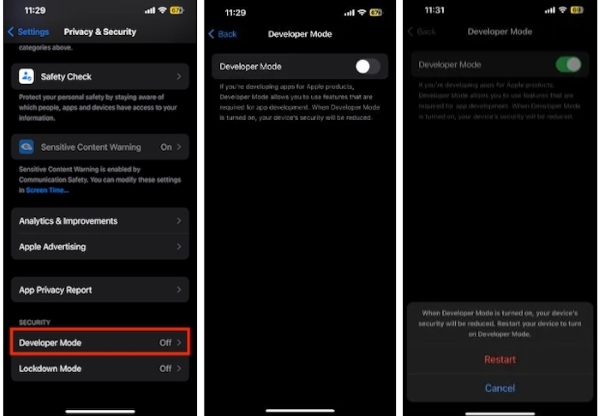

# 3️⃣ Cách bật chế độ nhà phát triển trên iPhone/iPad

## HƯỚNG DẪN CHI TIẾT

Để có thể cài đặt được các apps và nhân bản các apps sử dụng chứng chỉ của Apple bạn cần bật chế độ nhà phát triển trên thiết bị của bạn ( cái này chỉ xuất hiện khi bạn đã cài đặt ESign ở mục 2 )

Các bạn cần vào theo thứ tự như sau để được có thể bật chế độ nhà phát triển trên thiết bị của bạn

_<mark style="color:green;">**`Cài đặt ➔ Quyền riêng tư & Bảo mật ➔ Kéo xuống dưới cùng ➔ Chế độ nhà phát triển ➔ Bật nó lên nhé ➔ Khởi động lại`**</mark>_

Ảnh minh hoạ các bước&#x20;

<figure><figcaption></figcaption></figure>


Lưu ý: Sau khi các bạn bấm bật chế độ nhà phát triển thì thiết bị của bạn cần được khởi động lại, hãy chọn Khởi động lại và bật máy lên lại rồi tiếp tục với mục 4 để biết thêm về Cách nhập chứng chỉ của bạn vào ứng dụng ESign



[cach-nhap-chung-chi-vao-esign.md](cach-nhap-chung-chi-vao-esign.md)

