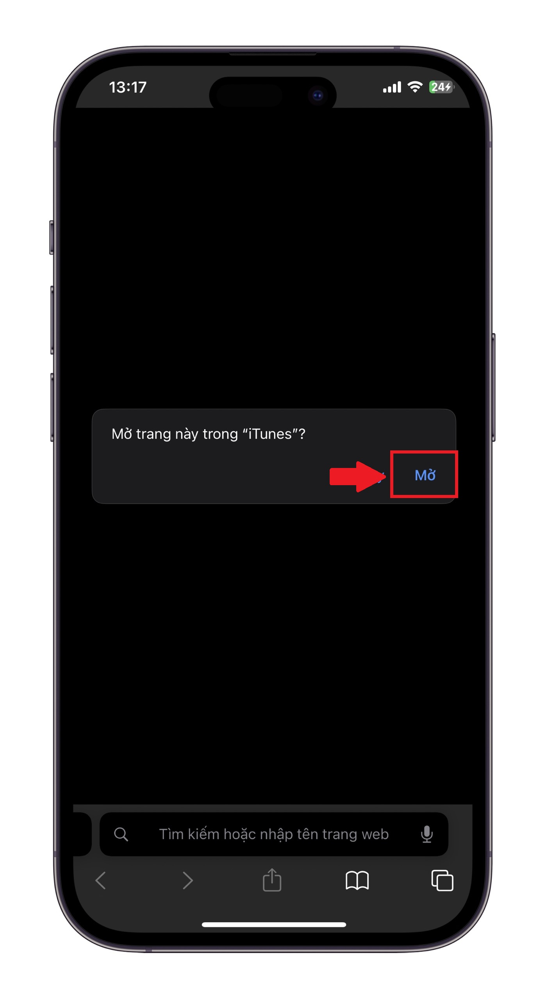
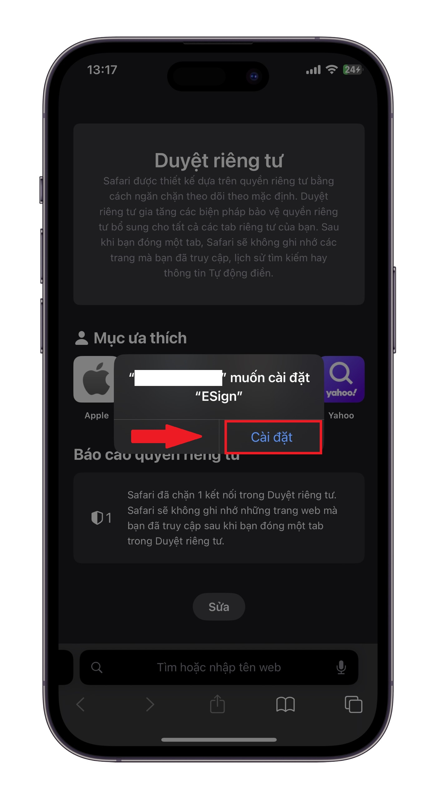

# 2️⃣ Cách cài đặt Esign

### ESign - Chìa khóa mở ra thế giới ứng dụng cho iPhone/iPad

_Bạn muốn cài đặt ứng dụng yêu thích nhưng không có trên App Store?_

_Bạn muốn cài đặt các ứng dụng trả phí, các ứng dụng có phiên bản PRO, Prenium, VIP mà không có quá nhiều chi phí để thanh toán ?_\
_Bạn muốn nhân bản các ứng dụng bạn đang sử dụng thành nhiều bản khác nhau và sử dụng dữ liệu độc lập ?_

**ESign chính là giải pháp dành cho bạn!**

Với ESign, bạn có thể:

* **Ký chứng chỉ** và **tinh chỉnh** file `.IPA` dễ dàng.
* **Cài đặt ứng dụng** lên `iPhone/iPad` **mà không cần máy tính**.
* **Nhân bản ứng dụng** trên `iPhone/iPad` của bạnthành 2 hoặc thậm chí 1000 Apps sử dụng dữ liệu độc lập

### CÁC CÁCH ĐỂ CÀI ĐẶT ESIGN TRÊN THIẾT BỊ CỦA BẠN

_Có 2 cách để cài đặt ứng dụng ESign thường dùng, 2 cách này đều phải có chứng chỉ của Apple trước đó thì mới có thể cài đặt được, được rồi chúng mình cùng nhau tìm hiểu nhé_

#### CÁCH 1: Cài đặt ESign bằng cách nhận liên kết cài đặt từ Admin

Sau khi bạn nhận đã đăng ký chứng chỉ với Admin, bạn cần đợi Apple duyệt chứng chỉ cho thiết bị của bạn, ngay sau khi thiết bị của bạn được duyệt Admin sẽ gửi cho bạn một liên kết để bạn có thể tải xuống ESign về điện thoại của mình

**Bước 1:** Sao chép liên kết mà Admin gửi cho bạn&#x20;

<figure><figcaption>
Ảnh minh hoạ về liên kết tải xuống ESign đã ký sẵn
</figcaption></figure> <figure><figcaption>
Bấm vào Sao chép nhé anh em
</figcaption></figure>

**Bước 2:** Mở Safari trên thiết bị của bạn và sau đó dán liên kết vào thanh địa chỉ và truy cập vào liên kết đó

<figure><figcaption></figcaption></figure>

**Bước 3:** Cài đặt ứng dụng ESign lên thiết bị của bạn \
Ngay sau khi thực hiện bước 2, trên màn hình sẽ hiển thị một hộp thoại hỏi bạn rằng bạn có cho phép mở iTunes không thì bạn bấm vào **`Mở`**

<figure><figcaption></figcaption></figure>

\
Sau đó bạn sẽ thấy một hộp thoại khác được hiện lên hỏi bạn rằng bạn có muốn cài đặt hay không thì hãy chọn **`Cài đặt`**&#x20;

<figure><figcaption>
Hoàn tât cài đặt ESign
</figcaption></figure>


Đến đây bạn đã hoàn tất việc cài đặt ứng dụng ESign trên thiết bị của bạn, việc cần làm là đọc tiếp phần [Cách bật chế độ nhà phát triển trên iPhone/iPad của bạn](cach-bat-che-do-nha-phat-trien-tren-iphone-ipad.md)



[cach-bat-che-do-nha-phat-trien-tren-iphone-ipad.md](cach-bat-che-do-nha-phat-trien-tren-iphone-ipad.md)


#### CÁCH 2: Cài đặt Esign bằng File chứng chỉ mà Admin đã gửi cho bạn ( update )
