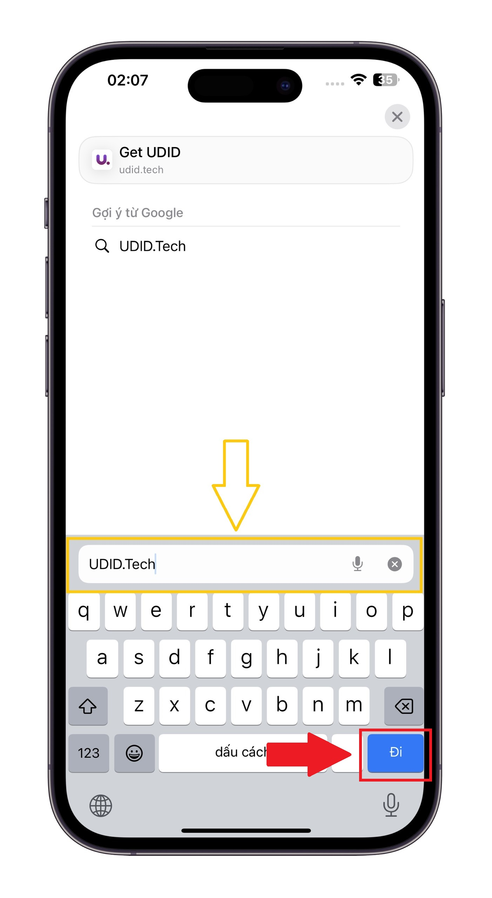
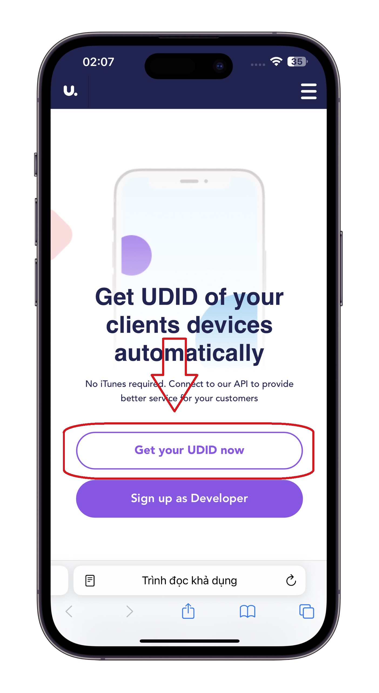
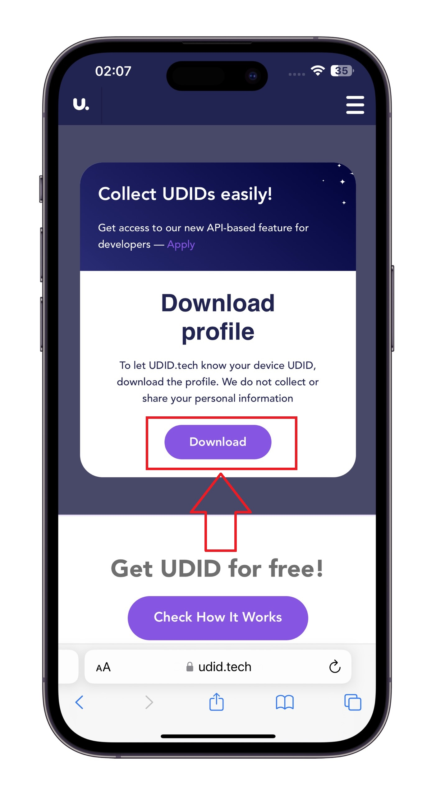
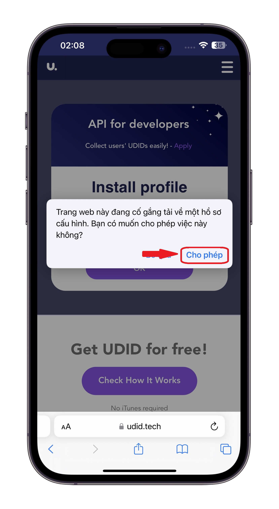
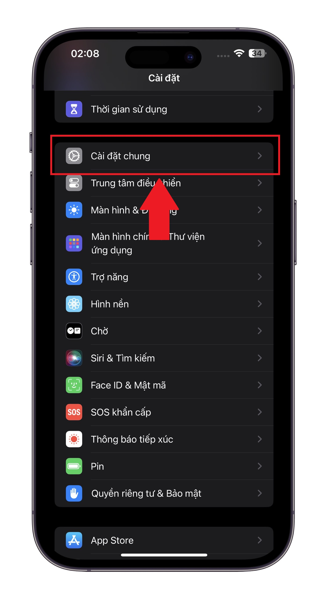
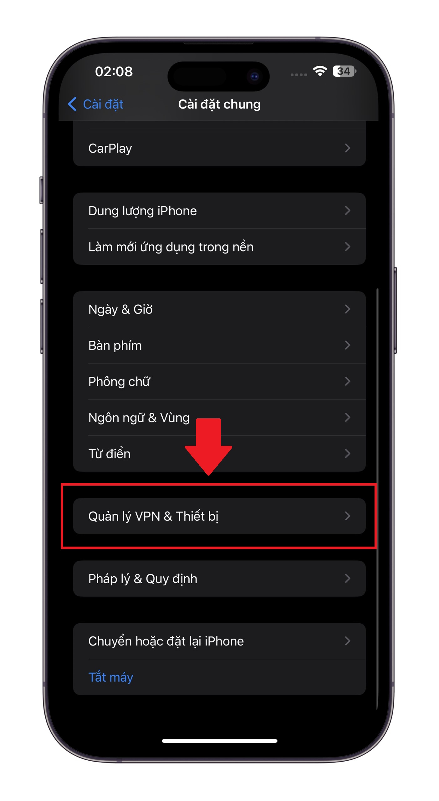
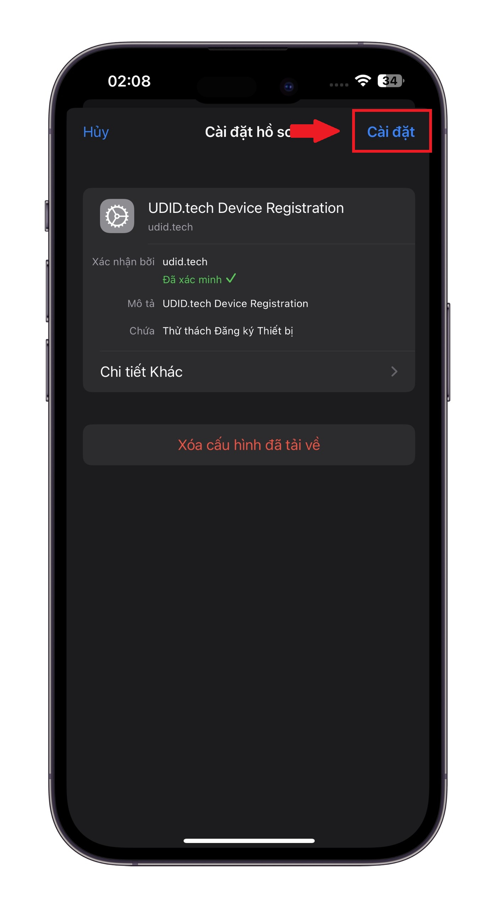
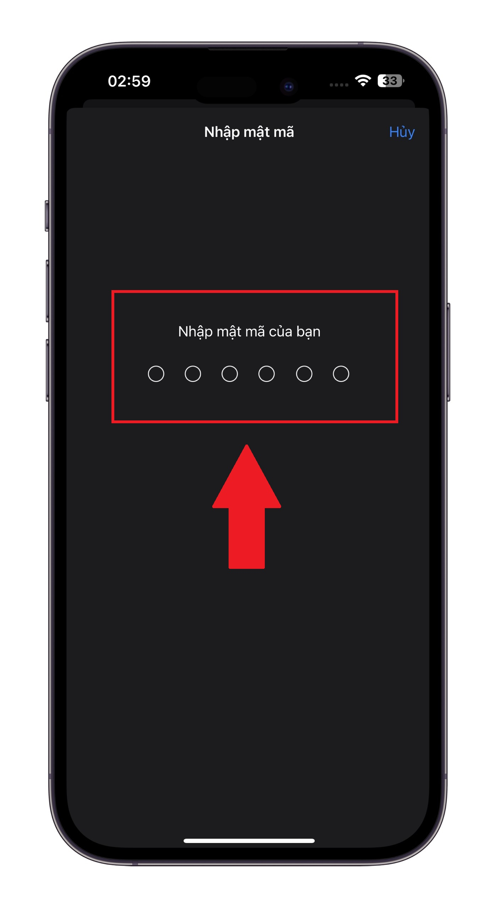
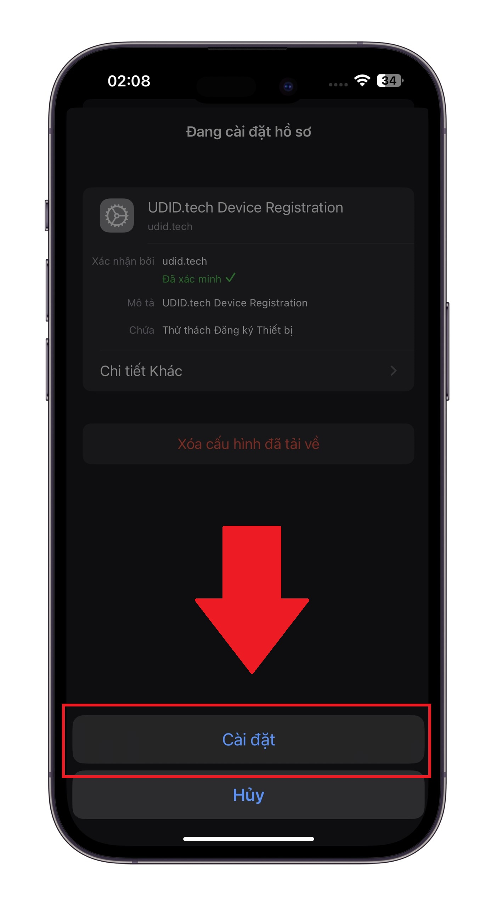
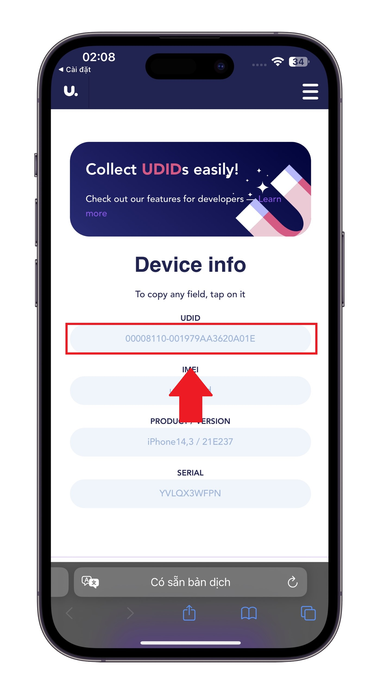

# 1️⃣ Cách lấy mã UDID của iPhone/iPad

## Các bước lấy mã UDID trên iPhone và iPad


**Lưu ý:** Các máy iPhone hoặc iPad của các bạn phải đang chạy ở phiên bản iOS 10.0 trở lên thì mới có thể lấy UDID và sau đó gửi cho Apple phê duyệt chứng chỉ cho thiết bị của bạn !


***

#### Bước 1: Truy cập website Get UDID.Tech bằng Safari

Các bạn mở trình duyệt Safari trên `iPhone/iPad` của các bạn và tiến hành truy cập vào website [UDID.Tech](https://udid.tech) và bấm vào nút <mark style="color:green;">**Get your UDID now**</mark> có trên màn hình điện thoại của các bạn như ảnh minh hoạ phía dưới:

<figure><figcaption>
Ảnh minh hoạ truy cập website lấy UDID của bạn
</figcaption></figure> <figure><figcaption>
Ảnh minh hoạ bấm vào Get you UDID now
</figcaption></figure>

#### Bước 2:  Tải xuống cấu hình Get UDID và xác nhận việc tải xuống cấu hình

Trên màn hình của các bạn sẽ hiện ra một màn hình mới với hình ảnh mô tả phía dưới, lúc này các bạn sẽ thấy ở phần <mark style="color:green;">**Collect UDIDs easily!**</mark> xuất hiện mục <mark style="color:red;">**Download**</mark>, các bạn cần bấm vào <mark style="color:red;">**Download**</mark> để cài đặt một cấu hình giúp xác định mã UDID của `iPhone/iPad` của các bạn

<figure><figcaption>
Ảnh minh hoạ bấm vào Download
</figcaption></figure>

Sau khi bấm Download trên màn hình sẽ hiện lên một thông báo với nội dung là: \
&#xNAN;_<mark style="color:blue;">"Trang web này đang cố gắng tài xuống hồ sơ cấu hình. Bạn có muốn cho phép điều này không?"</mark>_ \
\
Hãy yên tâm rằng nó không thể đánh cắp bất kỳ thông tin nào trên điện thoại của bạn, điều này chỉ nhằm mục đích xác định UIDID của `iPhone/iPad` ngoài ra không có bất kì nguy hiểm nào !\
\
Sau đó bạn hãy bấm vào nút <mark style="color:green;">**Cho Phép**</mark> có trên thông báo vừa xuất hiện

<figure><figcaption></figcaption></figure>

#### Bước 3: Cài đặt cấu hình và lấy thông tin về UDID

Sau khi bạn bấm Cho phép bạn cần vào cài đặt để cấp phép cài đặt hồ sơ này

Đầu tiên bạn vào **`Cài đặt`** của iPhone/iPad ➔ **`Chọn Cài đặt chung`**

<figure><figcaption>
Ảnh minh hoạ chọn cài đặt chung
</figcaption></figure>

Sau đó bạn lướt xuống cuối cùng chọn vào phần **`Quản lý VPN & Thiết bị`**

<figure><figcaption>
Ảnh minh hoạ chọn Quản lý VPN &#x26; Thiết bị
</figcaption></figure>

Ngay sau khi truy cập vào phần này bạn sẽ thấy 1 **`Cấu hình`** với tên <mark style="background-color:yellow;">**UDID.tech Device Registration,**</mark> việc của bạn là hãy bấm vào tên cấu hình như ảnh minh hoạ bên dưới:&#x20;

<figure><figcaption></figcaption></figure>

Màn hình lúc này xuất hiện như ảnh minh hoạ phía dưới bạn chỉ cần bấm vào nút **`Cài đặt`** ở góc phía trên bên phải màn hình

<figure><figcaption></figcaption></figure>

**Bạn cần nhập mật khẩu thiết bị của bạn để xác thực việc cài đặt**

<figure><figcaption></figcaption></figure>

Lúc này thiết bị sẽ yêu cầu bạn xác nhận lại có Cài đặt hay không bằng cách hiển thị ra một hộp thoại ở góc dưới màn hình, bạn chỉ cần bấm **`Cài đặt`** một lần nữa là được, ảnh minh hoạ:

<figure><figcaption></figcaption></figure>

Sau khi bạn đã bấm xác nhận thì Thiết bị của bạn sẽ tự động mở lại Safari và hiển thị mã **`UDID`** ở trên trang web như ảnh phía dưới, việc của bạn cần làm bây giờ là coppy lấy mã đó

<figure><figcaption></figcaption></figure>


Sau khi Đã lấy được UDID của bạn hãy gửi ngay mã UDID của bạn cho Admin để Admin có thể giúp bạn gửi cho Apple xét duyệt thiết bị của bạn, Ngay sau khi thiết bị của bạn được phế duyệt hãy tiến hành với mục 2 bạn cần cài đặt ứng dụng ESign trên thiết bị của bạn !



[cach-cai-dat-esign.md](cach-cai-dat-esign.md)

