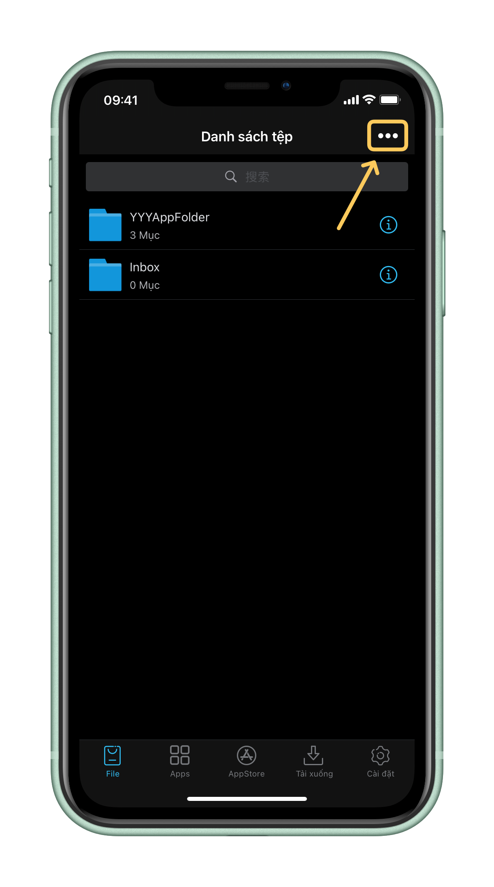
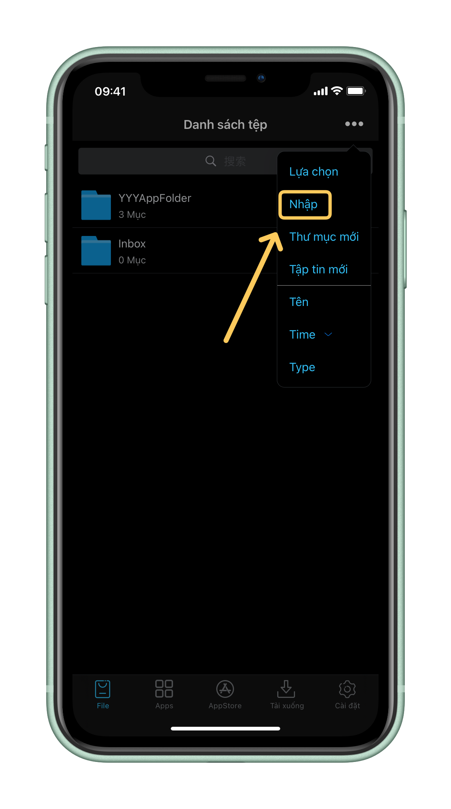

# 4️⃣ Cách nhập chứng chỉ vào Esign

#### **Bước 1: Khởi chạy ứng dụng ESign và đảm bảo rằng bạn đang ở trong tab '**<mark style="color:red;">**Tệp**</mark>**' hoặc&#x20;**<mark style="color:red;">**File**</mark>

<figure><figcaption></figcaption></figure>

#### Bước 2: Tiếp theo, hãy nhấn vào "•••" ở góc phải trên cùng.

<figure><figcaption></figcaption></figure>

**Bước 3: Bấm "**<mark style="color:red;">**Nhập**</mark>**" (**<mark style="color:red;">**Import**</mark>**)**

<figure><figcaption></figcaption></figure>

#### Bước 4: **Thư mục Tệp sẽ hiện lên, bạn cần tìm&#x20;**<mark style="color:green;">**file zip chứng chỉ của bạn**</mark>**&#x20;\[Bấm chọn file đó] Lưu ý: file trong ảnh chỉ là ví dụ:**

<figure><figcaption></figcaption></figure>

#### **Bước 5: Nhấn vào tệp zip mà bạn đã thêm vào ESign**

<figure><figcaption></figcaption></figure>

#### Bước 6: **Bấm chọn "**<mark style="color:red;">**Giải nén**</mark>**" (**<mark style="color:red;">**Unzip**</mark>**)**

<figure><figcaption></figcaption></figure>

#### **Bước 7: Truy cập thư mục bạn vừa giải nén**

<figure><figcaption></figcaption></figure>

**Bước 8: Bạn sẽ thấy file&#x20;**<mark style="color:red;">**.p12**</mark>**&#x20;và&#x20;**<mark style="color:red;">**.mobileprovision**</mark>**&#x20;cùng thư mục, hãy bấm vào file&#x20;**<mark style="color:red;">**.p12**</mark>

<figure><figcaption></figcaption></figure>

**Bước 9: Chọn "**<mark style="color:red;">**Nhập kho chứng chỉ**</mark>**" (**<mark style="color:red;">**Import Certificate ...**</mark>**)**

<figure><figcaption></figcaption></figure>

**Bước 10: Nhập&#x20;**<mark style="color:red;">**mật khẩu chứng chỉ**</mark>**&#x20;do Admin cung cấp khi bạn mua chứng chỉ và bấm "**<mark style="color:red;">**OK**</mark>**"**

<figure><figcaption></figcaption></figure>

#### LƯU Ý: **Để chắc chắn đã nhập chứng chỉ thành công, hãy đến tab "Cài đặt" (Settings)**

<figure><figcaption></figcaption></figure>

**Bấm "Quản lý chứng chỉ" (Certificate Management)**

<figure><figcaption></figcaption></figure>

**Nếu chứng chỉ bạn vừa thêm xuất hiện tại đây thì là đã thành công**

<figure><figcaption>
HOÀN TẤT NHẬP CHỨNG CHỈ APPLE VÀO ESIGN
</figcaption></figure>


## **Như vậy các bạn đã hoàn tất việc nhập Chứng Chỉ Apple vào ứng dụng Esign hãy tiếp tục đến với chuyên mục dưới đây để biết cách cài đặt ứng dụng thông qua Esign**



[cach-ky-va-cai-dat-.ipa-su-dung-esign.md](../huong-dan-cai-dat-apps-thong-qua-esign/cach-ky-va-cai-dat-.ipa-su-dung-esign.md)

